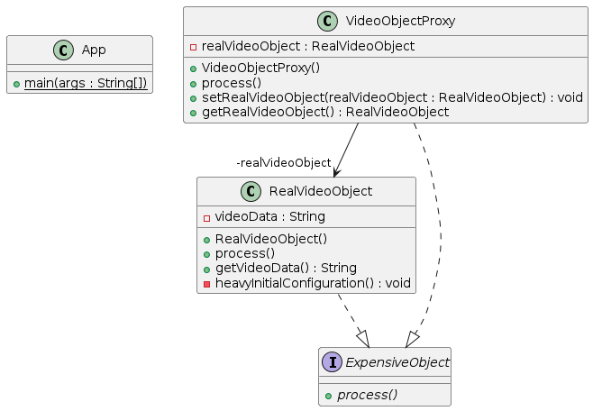

## Also known as

* Lazy Initialization Proxy
* Virtual Surrogate

## Intent

Provide a surrogate or placeholder for another object to control its creation and access, particularly when dealing with resource-intensive operations.

## Explanation

Real-world example

> Imagine a high-end art gallery that showcases expensive and delicate pieces of art. To protect the actual artwork and reduce the risk of damage or theft, the gallery initially displays high-quality photographs of the artworks. When a serious buyer expresses genuine interest, the gallery then brings out the original artwork from a secure storage area for viewing.
>
> In this analogy, the high-quality photograph serves as the virtual proxy for the actual artwork. The real artwork is only fetched and displayed when truly necessary, thus saving resources and reducing risk, similar to how the Virtual Proxy pattern defers object creation until it is needed.

In plain words

> The virtual proxy pattern allows a representative class to stand in for another class to control access to it, particularly for resource-intensive operations.

Wikipedia says

> A proxy that controls access to a resource that is expensive to create.

**Programmatic Example**

Consider an online video streaming platform where video objects are resource-intensive due to their large data size and required processing power. To efficiently manage resources, the system uses a virtual proxy to handle video objects. The virtual proxy defers the creation of actual video objects until they are explicitly required for playback, thus saving system resources and improving response times for users.

Given our example of a video streaming service, here is how it might be implemented:

First, we define an `ExpensiveObject` interface, which outlines the method for processing video.

```java
public interface ExpensiveObject {
    void process();
}
```

Here’s the implementation of a `RealVideoObject` that represents an expensive-to-create video object.

```java
@Slf4j
@Getter
public class RealVideoObject implements ExpensiveObject {

    public RealVideoObject() {
        heavyInitialConfiguration();
    }

    private void heavyInitialConfiguration() {
        LOGGER.info("Loading initial video configurations...");
    }

    @Override
    public void process() {
        LOGGER.info("Processing and playing video content...");
    }
}
```

The `VideoObjectProxy` serves as a stand-in for `RealExpensiveObject`.

```java
@Getter
public class VideoObjectProxy implements ExpensiveObject {
    private RealVideoObject realVideoObject;

    public void setRealVideoObject(RealVideoObject realVideoObject) {
        this.realVideoObject = realVideoObject;
    }

    @Override
    public void process() {
        if (realVideoObject == null) {
            realVideoObject = new RealVideoObject();
        }
        realVideoObject.process();
    }
}
```

And here’s how the proxy is used in the system.

```java
ExpensiveObject object = new VirtualProxy();
object.process();  // The real object is created at this point
object.process();  // Uses the already created object
```

Program output:

```
13:11:13.583 [main] INFO com.iluwatar.virtual.proxy.RealVideoObject -- Loading initial video configurations...
13:11:13.585 [main] INFO com.iluwatar.virtual.proxy.RealVideoObject -- Processing and playing video content...
13:11:13.585 [main] INFO com.iluwatar.virtual.proxy.RealVideoObject -- Processing and playing video content...
```

## Class diagram



## Applicability

Use the Virtual Proxy pattern when:

* Object creation is resource-intensive, and not all instances are utilized immediately or ever.
* The performance of a system can be significantly improved by deferring the creation of objects until they are needed.
* There is a need for control over resource usage in systems dealing with large quantities of high-overhead objects.

## Tutorials

* [The Proxy Pattern in Java - Baeldung](https://www.baeldung.com/java-proxy-pattern)

## Known Uses

* Lazy Initialization: Create objects only when they are actually needed.
* Resource Management: Efficiently manage resources by creating heavy objects only on demand.
* Access Control: Include logic to check conditions before delegating calls to the actual object.
* Performance Optimization: Incorporate caching of results or states that are expensive to obtain or compute.
* Data Binding and Integration: Delay integration and binding processes until the data is actually needed.
* In Java, the `java.awt.Image` class uses virtual proxies to load images on demand.
* Hibernate ORM framework uses proxies to implement lazy loading of entities.

## Consequences

Benefits:

* Reduces memory usage by deferring object creation.
* Can improve performance by delaying heavy operations until needed.

Trade-offs:

* Introduces complexity in the codebase.
* Can lead to unexpected behaviors if not handled properly, especially in multithreaded environments.

## Related Patterns

* [Proxy](https://java-design-patterns.com/patterns/proxy/): Virtual Proxy is a specific type of the Proxy pattern focused on lazy initialization.
* [Lazy Loading](https://java-design-patterns.com/patterns/lazy-loading/): Directly related as the core idea of Virtual Proxy is to defer object creation.
* [Decorator](https://java-design-patterns.com/patterns/decorator/): Similar in structure, but Decorators add behavior to the objects while proxies control access.

## Credits

* [Design Patterns: Elements of Reusable Object-Oriented Software](https://amzn.to/3w0pvKI)
* [Effective Java](https://amzn.to/4cGk2Jz)
* [Patterns of Enterprise Application Architecture](https://amzn.to/3WfKBPR)
