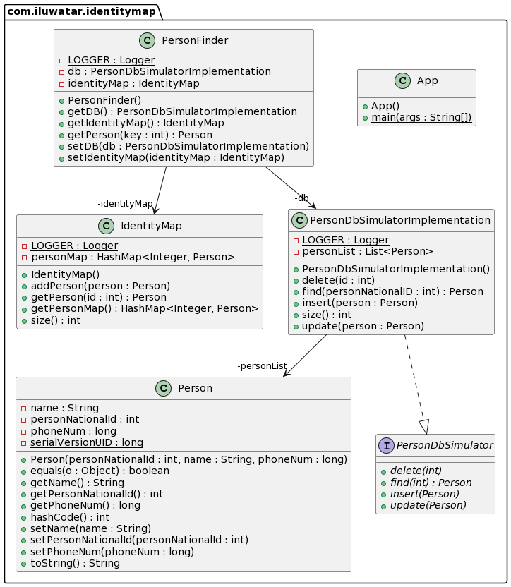

## Propósito

Garantiza que cada objeto se cargue una sola vez guardando cada objeto cargado en un mapa.
Busca objetos utilizando el mapa cuando se refiere a ellos.

## Explicación

Ejemplo del mundo real

> Estamos escribiendo un programa que el usuario puede utilizar para encontrar los registros de una persona determinada en una base de datos.

En palabras simples

> Construir un mapa de identidades que almacene los registros de los elementos buscados recientemente en la base de datos. Cuando busquemos el mismo registro la próxima vez lo cargaremos desde el mapa no iremos a la base de datos.

Wikipedia dice

> En el diseño de DBMS, el patrón de mapa de identidad es un patrón de diseño de acceso a base de datos utilizado para mejorar el rendimiento, proporcionando un contexto específico, en la memoria caché para evitar la recuperación duplicada de los mismos datos de objetos de la base de datos

**Ejemplo programático**

* Para el propósito de esta demostración supongamos que ya hemos creado una instancia de base de datos **db**.
* Veamos primero la implementación de una entidad persona y sus campos:

```java
@EqualsAndHashCode(onlyExplicitlyIncluded = true)
@Getter
@Setter
@AllArgsConstructor
public final class Person implements Serializable {

  private static final long serialVersionUID = 1L;

  @EqualsAndHashCode.Include
  private int personNationalId;
  private String name;
  private long phoneNum;

  @Override
  public String toString() {

    return "Person ID is : " + personNationalId + " ; Person Name is : " + name + " ; Phone Number is :" + phoneNum;

  }

}

```

* La siguiente es la implementación del personFinder que es la entidad que el usuario utilizará para buscar un registro en nuestra base de datos. Tiene adjunta la BD correspondiente. También mantiene un IdentityMap para almacenar los registros leídos recientemente.

```java
@Slf4j
@Getter
@Setter
public class PersonFinder {
  private static final long serialVersionUID = 1L;
  //  Access to the Identity Map
  private IdentityMap identityMap = new IdentityMap();
  private PersonDbSimulatorImplementation db = new PersonDbSimulatorImplementation();
  /**
   * get person corresponding to input ID.
   *
   * @param key : personNationalId to look for.
   */
  public Person getPerson(int key) {
    // Try to find person in the identity map
    Person person = this.identityMap.getPerson(key);
    if (person != null) {
      LOGGER.info("Person found in the Map");
      return person;
    } else {
      // Try to find person in the database
      person = this.db.find(key);
      if (person != null) {
        this.identityMap.addPerson(person);
        LOGGER.info("Person found in DB.");
        return person;
      }
      LOGGER.info("Person with this ID does not exist.");
      return null;
    }
  }
}

```

* El campo de mapa de identidad en la clase anterior es simplemente una abstracción de un hashMap con **personNationalId** como claves y el objeto persona correspondiente como valor. Aquí está su implementación:

```java
@Slf4j
@Getter
public class IdentityMap {
  private Map<Integer, Person> personMap = new HashMap<>();
  /**
   * Add person to the map.
   */
  public void addPerson(Person person) {
    if (!personMap.containsKey(person.getPersonNationalId())) {
      personMap.put(person.getPersonNationalId(), person);
    } else { // Ensure that addPerson does not update a record. This situation will never arise in our implementation. Added only for testing purposes.
      LOGGER.info("Key already in Map");
    }
  }

  /**
   * Get Person with given id.
   *
   * @param id : personNationalId as requested by user.
   */
  public Person getPerson(int id) {
    Person person = personMap.get(id);
    if (person == null) {
      LOGGER.info("ID not in Map.");
    }
    return person;
  }

  /**
   * Get the size of the map.
   */
  public int size() {
    if (personMap == null) {
      return 0;
    }
    return personMap.size();
  }

}

```

* Ahora debemos construir una persona ficticia para fines de demostración y poner a esa persona en nuestra base de datos.

```java
  Person person1 = new Person(1, "John", 27304159);
  db.insert(person1);
```

* Ahora vamos a crear un objeto person finder y buscar a la persona con personNationalId = 1(supongamos que el objeto personFinder ya tiene la db y un IdentityMap adjunto):

```java
  PersonFinder finder = new PersonFinder();
  finder.getPerson(1);
```

* En esta etapa este registro se cargará desde la base de datos y la salida sería:

```java
  ID not in Map.
  Person ID is:1;Person Name is:John;Phone Number is:27304159
  Person found in DB.
```

* Sin embargo, la próxima vez que busquemos de nuevo este registro lo encontraremos en el mapa, por lo que no necesitaremos ir a la base de datos.

```java
  Person ID is:1;Person Name is:John;Phone Number is:27304159
  Person found in Map.
```

* Si el registro correspondiente no está en la base de datos, se lanza una excepción. Esta es su implementación.

```java
public class IdNotFoundException extends RuntimeException {
  public IdNotFoundException(final String message) {
    super(message);
  }
}
```

## Diagrama de clases



## Aplicabilidad

* La idea detrás del patrón Identity Map es que cada vez que leemos un registro de la base de datos, primero comprobamos el Identity Map para ver si el registro ya ha sido recuperado. Esto nos permite simplemente devolver una nueva referencia al registro en memoria en lugar de crear un nuevo objeto, manteniendo la integridad referencial.
* Una ventaja secundaria del Mapa de Identidad es que, al actuar como caché, reduce el número de llamadas a la base de datos necesarias para recuperar objetos, lo que supone una mejora del rendimiento.

## Créditos

* [Identity Map](https://www.sourcecodeexamples.net/2018/04/identity-map-pattern.html)
