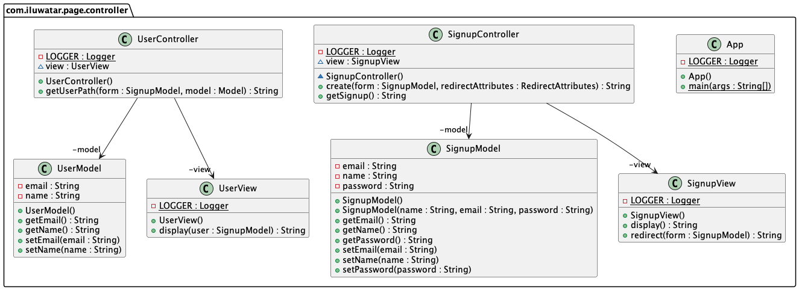

## Nombre / clasificación

Page Controller

## Propósito

Se trata de un enfoque de una página que conduce a un archivo lógico que gestiona acciones o peticiones en un sitio web.

## Explicación

Un ejemplo real

> En un sitio web de compras, hay una página de registro para dar de alta un perfil de usuario. Una vez finalizado el registro, la página de registro se redirigirá a una página de usuario para mostrar la información registrada del usuario.

En pocas palabras

> El controlador de página gestiona las peticiones HTTP y los datos en una página específica usando la idea MVC.
> La idea es que una página contiene un controlador que maneja el modelo y la vista.

**Ejemplo programático**

Aquí está el controlador Signup cuando un usuario registra su información para un sitio web.

```java
@Slf4j
@Controller
@Component
public class SignupController {
  SignupView view = new SignupView();
  /**
   * Signup Controller can handle http request and decide which model and view use.
   */
  SignupController() {
  }

  /**
   * Handle http GET request.
   */
  @GetMapping("/signup")
  public String getSignup() {
    return view.display();
  }

  /**
   * Handle http POST request and access model and view.
   */
  @PostMapping("/signup")
  public String create(SignupModel form, RedirectAttributes redirectAttributes) {
    LOGGER.info(form.getName());
    LOGGER.info(form.getEmail());
    redirectAttributes.addAttribute("name", form.getName());
    redirectAttributes.addAttribute("email", form.getEmail());
    redirectAttributes.addFlashAttribute("userInfo", form);
    return view.redirect(form);
  }
}
```

Aquí está el modelo y la vista de Signup que son manejados por el controlador de Signup.

```java
@Component
@Getter
@Setter
public class SignupModel {
  private String name;
  private String email;
  private String password;
  
  public SignupModel() {
  }
}
```

```java
@Slf4j
public class SignupView {
  public SignupView() {
  }

  public String display() {
    LOGGER.info("display signup front page");
    return "/signup";
  }

  /**
   * redirect to user page.
   */
  public String redirect(SignupModel form) {
    LOGGER.info("Redirect to user page with " + "name " + form.getName() + " email " + form.getEmail());
    return "redirect:/user";
  }
}
```

Este es el Controlador de Usuario para manejar la petición Get en una página de usuario.

```java
@Slf4j
@Controller
public class UserController {
  UserView view = new UserView();

  public UserController() {}

  /**
   * Handle http GET request and access view and model.
   */
  @GetMapping("/user")
  public String getUserPath(SignupModel form, Model model) {
    model.addAttribute("name", form.getName());
    model.addAttribute("email", form.getEmail());
    return view.display(form);
  }
}
```

Aquí están el Modelo de Usuario y la Vista que son manejados por el controlador de Usuario.

```java
@Getter
@Setter
public class UserModel {
  private String name;
  private String email;

  public UserModel() {}
}
```

```java
@Slf4j
public class UserView {
  /**
   * displaying command to generate html.
   * @param user model content.
   */
  public String display(SignupModel user) {
    LOGGER.info("display user html" + " name " + user.getName() + " email " + user.getEmail());
    return "/user";
  }
}
```

## Diagrama de clases



## Aplicabilidad

Utilice el patrón Page Controller cuando

- implementas un sitio donde la mayor parte de la lógica del controlador es simple
- implementa un sitio en el que determinadas acciones se gestionan con una página de servidor concreta

## Créditos

- [Page Controller](https://www.martinfowler.com/eaaCatalog/pageController.html)
- [Pattern of Enterprise Application Architecture](https://www.martinfowler.com/books/eaa.html)