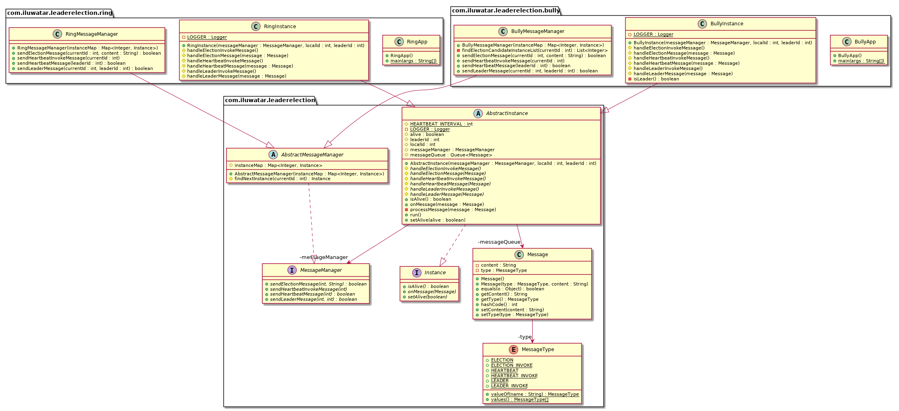

Có, mẫu thiết kế **Leader Election** (Bầu chọn lãnh đạo) là một phương pháp được sử dụng trong các hệ thống phân tán để đảm bảo rằng một node (hoặc tiến trình) được chọn làm "lãnh đạo" hoặc "trưởng nhóm" để điều phối và quản lý các hoạt động trong hệ thống. Đây là một phần quan trọng trong việc duy trì đồng bộ hóa và quản lý tài nguyên trong các hệ thống phân tán.

### Mục Đích

- **Đảm Bảo Tính Nhất Quán:**
    - Trong các hệ thống phân tán, có thể cần một node duy nhất đảm nhận vai trò điều phối để đảm bảo rằng các quyết định hoặc hành động được thực hiện một cách đồng bộ.

- **Quản Lý Tài Nguyên:**
    - Lãnh đạo có thể chịu trách nhiệm phân phối tài nguyên hoặc nhiệm vụ cho các node khác trong hệ thống.

- **Khả Năng Mở Rộng:**
    - Lãnh đạo giúp phân phối công việc và quản lý các node khác để đảm bảo hiệu suất và khả năng mở rộng của hệ thống.

### Các Phương Pháp Thực Hiện

1. **Thuật Toán Paxos:**
    - **Paxos** là một thuật toán phổ biến để đạt được sự đồng thuận trong các hệ thống phân tán. Nó cho phép một nhóm các node đồng ý về một giá trị (như node lãnh đạo) mặc dù có thể có lỗi hoặc mất kết nối.

2. **Thuật Toán Raft:**
    - **Raft** là một thuật toán đồng thuận dễ hiểu hơn so với Paxos. Nó sử dụng một quy trình bầu chọn để chọn một node làm lãnh đạo, và các node khác theo dõi và đồng bộ với lãnh đạo.

3. **Thuật Toán Zab (Zookeeper Atomic Broadcast):**
    - **Zab** được sử dụng trong Zookeeper để quản lý bầu chọn lãnh đạo và đảm bảo rằng các cập nhật được phân phối đồng bộ đến tất cả các node.

### Cách Thực Hiện

- **Bầu Chọn:**
    - Các node trong hệ thống thực hiện bầu chọn để chọn một node làm lãnh đạo. Quy trình này có thể bao gồm các vòng bầu chọn, các thông điệp yêu cầu và phản hồi giữa các node.

- **Đảm Bảo Khả Năng Thay Thế:**
    - Nếu lãnh đạo hiện tại gặp sự cố hoặc không còn khả năng hoạt động, hệ thống phải có cơ chế để bầu chọn một lãnh đạo mới.

- **Quản Lý Trạng Thái:**
    - Lãnh đạo duy trì và đồng bộ hóa trạng thái của hệ thống với các node khác.

### Ví Dụ

- **Zookeeper:**
    - Zookeeper là một hệ thống quản lý phân tán phổ biến sử dụng thuật toán Zab để bầu chọn lãnh đạo và duy trì tính đồng bộ giữa các node.

- **Hadoop:**
    - Trong hệ thống Hadoop, các dịch vụ như NameNode cũng sử dụng bầu chọn lãnh đạo để quản lý trạng thái của hệ thống phân tán.

### Lợi Ích

- **Đảm Bảo Đồng Bộ:**
    - Có một node lãnh đạo giúp đảm bảo các hoạt động và quyết định được thực hiện một cách nhất quán trong hệ thống phân tán.

- **Quản Lý Tài Nguyên Hiệu Quả:**
    - Lãnh đạo có thể phân phối nhiệm vụ và tài nguyên hiệu quả hơn, giảm thiểu tình trạng xung đột và tăng hiệu suất.

- **Khả Năng Thay Thế:**
    - Mẫu thiết kế có cơ chế thay thế lãnh đạo nếu node hiện tại gặp sự cố, giúp duy trì tính khả dụng của hệ thống.

Hy vọng điều này giúp bạn hiểu rõ hơn về mẫu thiết kế Leader Election và ứng dụng của nó trong các hệ thống phân tán!