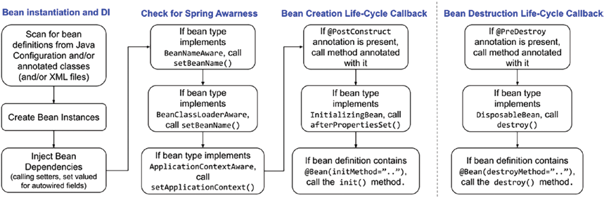

Đúng vậy, Spring cung cấp ba cơ chế để các bean có thể tham gia vào các sự kiện vòng đời (lifecycle events) và thực hiện xử lý bổ sung khi cần thiết. Dưới đây là chi tiết về từng cơ chế:

### 1. Interface-based Mechanism

Bean của bạn có thể implement một interface cụ thể để nhận thông báo về các sự kiện vòng đời. Spring sẽ gọi các phương thức callback được định nghĩa trong interface đó.

#### Ví dụ:
- **InitializingBean**: Cung cấp phương thức `afterPropertiesSet()` để thực hiện xử lý sau khi tất cả các thuộc tính của bean được thiết lập.
- **DisposableBean**: Cung cấp phương thức `destroy()` để thực hiện xử lý trước khi bean bị hủy.

```java
public class MyBean implements InitializingBean, DisposableBean {
    
    @Override
    public void afterPropertiesSet() throws Exception {
        // Code to execute after properties are set
        System.out.println("Bean is initialized");
    }

    @Override
    public void destroy() throws Exception {
        // Code to execute before bean is destroyed
        System.out.println("Bean is destroyed");
    }
}
```

### 2. Method-based Mechanism

Spring cho phép bạn chỉ định tên của các phương thức sẽ được gọi khi bean được khởi tạo và khi bean bị hủy trong cấu hình ApplicationContext.

#### XML Configuration:
```xml
<bean id="myBean" class="com.example.MyBean" init-method="init" destroy-method="cleanup"/>
```

#### Java Configuration:
```java
@Configuration
public class AppConfig {
    
    @Bean(initMethod = "init", destroyMethod = "cleanup")
    public MyBean myBean() {
        return new MyBean();
    }
}
```

#### MyBean Class:
```java
public class MyBean {
    
    public void init() {
        // Code to execute after properties are set
        System.out.println("Bean is initialized");
    }
    
    public void cleanup() {
        // Code to execute before bean is destroyed
        System.out.println("Bean is destroyed");
    }
}
```

### 3. Annotation-based Mechanism

Bạn có thể sử dụng các annotation JSR-250 để chỉ định các phương thức mà Spring nên gọi sau khi bean được khởi tạo hoặc trước khi bean bị hủy.

#### Ví dụ:
- **@PostConstruct**: Được gọi sau khi bean được khởi tạo và tất cả các thuộc tính được thiết lập.
- **@PreDestroy**: Được gọi trước khi bean bị hủy.

```java
import javax.annotation.PostConstruct;
import javax.annotation.PreDestroy;

public class MyBean {
    
    @PostConstruct
    public void init() {
        // Code to execute after properties are set
        System.out.println("Bean is initialized");
    }
    
    @PreDestroy
    public void cleanup() {
        // Code to execute before bean is destroyed
        System.out.println("Bean is destroyed");
    }
}
```

### Tóm lại:
- **Interface-based Mechanism**: Sử dụng `InitializingBean` và `DisposableBean` interfaces.
- **Method-based Mechanism**: Sử dụng cấu hình `init-method` và `destroy-method` trong XML hoặc Java configuration.
- **Annotation-based Mechanism**: Sử dụng các annotation `@PostConstruct` và `@PreDestroy`.


Mỗi cơ chế có ưu và nhược điểm riêng, và bạn có thể chọn cơ chế phù hợp nhất với nhu cầu của mình.