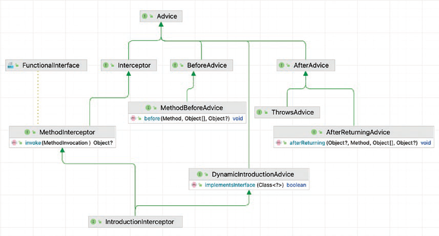

### Spring AOP (Lập trình hướng khía cạnh)

#### Các khái niệm chính:

1. **Aspect (Khía cạnh)**:
    - Là một module hóa của một mối quan tâm cắt ngang nhiều lớp. Trong Spring AOP, các khía cạnh được triển khai bằng cách sử dụng các lớp thông thường được chú thích với `@Aspect`.

2. **Join Point (Điểm nối)**:
    - Là một điểm trong quá trình thực thi của chương trình, chẳng hạn như việc thực thi một phương thức hoặc xử lý một ngoại lệ. Trong Spring AOP, điểm nối luôn đại diện cho việc thực thi phương thức.

3. **Advice (Lời khuyên)**:
    - Hành động được thực hiện bởi một khía cạnh tại một điểm nối cụ thể. Có các loại lời khuyên khác nhau bao gồm:
        - **Before Advice (Lời khuyên trước)**: Thực thi trước một điểm nối.
        - **After (Finally) Advice (Lời khuyên sau - Cuối cùng)**: Thực thi sau một điểm nối, bất kể kết quả của nó.
        - **After Returning Advice (Lời khuyên sau khi trả về)**: Thực thi sau khi một điểm nối hoàn thành bình thường.
        - **After Throwing Advice (Lời khuyên sau khi ném ngoại lệ)**: Thực thi nếu một phương thức thoát ra bằng cách ném một ngoại lệ.
        - **Around Advice (Lời khuyên xung quanh)**: Bao quanh một điểm nối (kết hợp lời khuyên trước và sau).

4. **Pointcut (Điểm cắt)**:
    - Là một biểu thức khớp với các điểm nối. Điểm cắt được sử dụng để xác định nơi lời khuyên nên được áp dụng.

5. **Introduction (Giới thiệu)**:
    - Cho phép thêm các phương thức hoặc thuộc tính mới vào các lớp hiện có.

6. **Target Object (Đối tượng mục tiêu)**:
    - Đối tượng được lời khuyên của một hoặc nhiều khía cạnh. Cũng được gọi là đối tượng proxy.

7. **AOP Proxy (Proxy AOP)**:
    - Là một đối tượng được tạo bởi khung AOP để triển khai các hợp đồng khía cạnh (các phương thức lời khuyên) và ủy quyền cho đối tượng mục tiêu. Trong Spring AOP, proxy có thể là proxy động JDK hoặc proxy CGLIB.

8. **Weaving (Đan xen)**:
    - Quá trình liên kết các khía cạnh với các loại ứng dụng khác hoặc đối tượng để tạo ra một đối tượng được tư vấn. Quá trình này có thể được thực hiện tại thời điểm biên dịch, tải hoặc chạy thời gian.



#### Áp dụng Spring AOP:

1. **Thêm phụ thuộc Spring AOP**:
    - Đảm bảo rằng phụ thuộc `spring-boot-starter-aop` được bao gồm trong `pom.xml` (Maven) hoặc `build.gradle` (Gradle).

   **Maven**:
   ```xml
   <dependency>
       <groupId>org.springframework.boot</groupId>
       <artifactId>spring-boot-starter-aop</artifactId>
   </dependency>
   ```

   **Gradle**:
   ```gradle
   implementation 'org.springframework.boot:spring-boot-starter-aop'
   ```

2. **Định nghĩa một Aspect**:
    - Tạo một lớp được chú thích với `@Aspect` và định nghĩa các điểm cắt và lời khuyên.

   ```java
   import org.aspectj.lang.annotation.Aspect;
   import org.aspectj.lang.annotation.Before;
   import org.springframework.stereotype.Component;

   @Aspect
   @Component
   public class LoggingAspect {

       @Before("execution(* com.example.service.*.*(..))")
       public void logBeforeMethodExecution() {
           System.out.println("Một phương thức sắp được thực thi");
       }
   }
   ```

3. **Kích hoạt AspectJ Auto Proxy**:
    - Kích hoạt auto proxy AspectJ trong cấu hình Spring của bạn bằng cách sử dụng chú thích `@EnableAspectJAutoProxy`.

   ```java
   import org.springframework.context.annotation.Configuration;
   import org.springframework.context.annotation.EnableAspectJAutoProxy;

   @Configuration
   @EnableAspectJAutoProxy
   public class AppConfig {
   }
   ```

4. **Tạo các Pointcut**:
    - Định nghĩa các điểm cắt bằng cách sử dụng các biểu thức để khớp với các điểm nối mà lời khuyên nên được áp dụng.

   ```java
   import org.aspectj.lang.annotation.Pointcut;

   @Pointcut("execution(* com.example.service.*.*(..))")
   public void serviceLayer() {
   }
   ```

5. **Định nghĩa các Advice**:
    - Triển khai các loại lời khuyên khác nhau bằng cách sử dụng các chú thích thích hợp (`@Before`, `@After`, `@AfterReturning`, `@AfterThrowing`, `@Around`).

   ```java
   import org.aspectj.lang.annotation.AfterReturning;
   import org.aspectj.lang.annotation.Before;
   import org.springframework.stereotype.Component;

   @Aspect
   @Component
   public class LoggingAspect {

       @Before("execution(* com.example.service.*.*(..))")
       public void logBeforeMethodExecution() {
           System.out.println("Một phương thức sắp được thực thi");
       }

       @AfterReturning(pointcut = "execution(* com.example.service.*.*(..))", returning = "result")
       public void logAfterMethodExecution(Object result) {
           System.out.println("Một phương thức đã thực thi với kết quả: " + result);
       }
   }
   ```

Bằng cách hiểu các khái niệm chính này và tuân theo các bước này, bạn có thể áp dụng Spring AOP hiệu quả vào các dự án của mình để module hóa các mối quan tâm cắt ngang như ghi log, quản lý giao dịch và bảo mật.