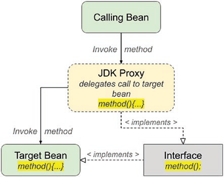

Trong Spring, có hai loại proxy chính được sử dụng: JDK proxy và CGLIB proxy.

### JDK Proxy
JDK proxy là loại proxy cơ bản nhất trong Spring. Nó chỉ có thể tạo proxy cho các interface, chứ không phải cho các class. Điều này có nghĩa là bất kỳ đối tượng nào bạn muốn proxy phải triển khai ít nhất một interface, và proxy kết quả sẽ là một đối tượng triển khai interface đó.

#### Cơ Chế Hoạt Động của JDK Proxy
1. **Yêu Cầu Interface**: Để sử dụng JDK proxy, đối tượng cần phải triển khai ít nhất một interface.
2. **Intercept Method Calls**: Tất cả các lời gọi phương thức trên đối tượng proxy được JVM chặn lại và chuyển hướng đến phương thức `invoke()` của proxy.
3. **Invoke Method**: Phương thức `invoke()` xác định xem phương thức được gọi có được advise hay không (theo các quy tắc xác định bởi pointcut). Nếu có, nó sẽ gọi chuỗi advice rồi mới gọi phương thức chính bằng cách sử dụng reflection.
4. **Unadvised Methods**: Với các phương thức không được advise, phương thức `invoke()` vẫn được gọi, các kiểm tra vẫn được thực hiện, và phương thức vẫn được gọi thông qua reflection. Điều này gây ra overhead ở runtime cho mỗi lần phương thức được gọi, mặc dù proxy không thực hiện thêm xử lý nào ngoài việc gọi phương thức không được advise qua reflection.

### Ý Nghĩa và Ứng Dụng
- **Thiết Kế Tốt Hơn**: Việc sử dụng interface giúp thiết kế hệ thống tốt hơn, tạo ra sự tách biệt giữa khai báo và triển khai.
- **Legacy Code**: Tuy nhiên, trong trường hợp làm việc với mã bên thứ ba hoặc mã cũ mà không thể sử dụng interface, cần phải sử dụng CGLIB proxy.
- **Runtime Overhead**: JDK proxy tạo ra một overhead nhất định do phải sử dụng reflection mỗi khi gọi phương thức, ngay cả với những phương thức không được advise.
- **ProxyFactory**: Trong Spring, bạn có thể chỉ định sử dụng JDK proxy bằng cách sử dụng phương thức `setInterfaces()` trong lớp `AdvisedSupport` mà lớp `ProxyFactory` mở rộng gián tiếp.

### ProxyFactory
- **Set Interfaces**: Bạn có thể cấu hình `ProxyFactory` để sử dụng JDK proxy bằng cách chỉ định danh sách các interface cần proxy bằng cách sử dụng phương thức `setInterfaces()`.

Nhìn chung, JDK proxy là một cơ chế linh hoạt để triển khai AOP trong Spring, giúp bạn có thể áp dụng các cross-cutting concerns (như logging, transaction management) một cách rõ ràng và dễ dàng mà không làm thay đổi logic chính của ứng dụng. Tuy nhiên, việc sử dụng nó cũng cần cân nhắc đến overhead do reflection và sự giới hạn khi làm việc với các lớp không triển khai interface.