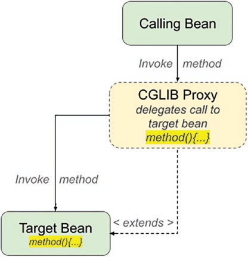

### Cơ Chế và Ý Nghĩa của CGLIB Proxy trong Spring

#### Cơ Chế Hoạt Động của CGLIB Proxy
CGLIB (Code Generation Library) proxy là một loại proxy khác trong Spring, được sử dụng khi không thể hoặc không muốn sử dụng JDK proxy. Dưới đây là các điểm chính về cơ chế hoạt động của CGLIB proxy:

1. **Sinh Bytecode Động**: CGLIB sinh bytecode cho một lớp mới tại thời điểm chạy (on-the-fly) để tạo proxy. Proxy này sẽ là một lớp con của lớp mục tiêu (target object class).
2. **Quyết Định Duy Nhất**: Khi một CGLIB proxy được tạo lần đầu, CGLIB sẽ hỏi Spring cách xử lý từng phương thức. Điều này có nghĩa là nhiều quyết định được thực hiện một lần duy nhất cho CGLIB proxy, thay vì mỗi lần gọi phương thức như trong JDK proxy.
3. **Giảm Overhead**: CGLIB sinh bytecode để gọi trực tiếp các phương thức không được advise, giảm overhead runtime do proxy gây ra. CGLIB cũng xác định xem một phương thức có thể trả về `this` hay không; nếu không, nó cho phép gọi phương thức trực tiếp, giảm thêm overhead.
4. **Fixed-Advice Chains**: CGLIB xử lý các chuỗi advice cố định (fixed-advice chains) một cách đặc biệt, giảm overhead runtime khi thực hiện một chuỗi advice. Chuỗi advice cố định là chuỗi không thay đổi sau khi proxy được tạo. Mặc định, bạn có thể thay đổi advisors và advice trên một proxy ngay cả sau khi nó được tạo, mặc dù điều này hiếm khi cần thiết.

#### Ý Nghĩa của CGLIB Proxy
- **Linh Hoạt Hơn**: CGLIB proxy cung cấp nhiều linh hoạt hơn trong cách xử lý các phương thức so với JDK proxy do khả năng sinh bytecode động.
- **Giảm Overhead**: Việc giảm overhead runtime là một lợi thế lớn của CGLIB proxy, đặc biệt với các phương thức không được advise.
- **Xử Lý Method Call**: CGLIB proxy xử lý các lời gọi phương thức hiệu quả hơn khi không cần phải qua `invoke()` mỗi lần, giúp cải thiện hiệu suất của ứng dụng.

#### Hạn Chế của CGLIB Proxy
1. **Lớp Cuối (Final Class)**: Không thể tạo proxy cho các lớp cuối (final classes) vì chúng không thể được kế thừa.
2. **Thành Viên Tĩnh (Static Members)**: Các thành viên tĩnh không thể được proxy vì chúng thuộc về lớp, không phải đối tượng cụ thể.
3. **Phương Thức Riêng Tư (Private Methods)**: Các phương thức riêng tư không thể được proxy vì lớp con không thể truy cập chúng.

Nhìn chung, CGLIB proxy là một công cụ mạnh mẽ và linh hoạt trong Spring AOP, đặc biệt hữu ích khi làm việc với các lớp không triển khai interface hoặc khi muốn giảm overhead runtime. Tuy nhiên, cần lưu ý các hạn chế của nó để sử dụng hiệu quả.