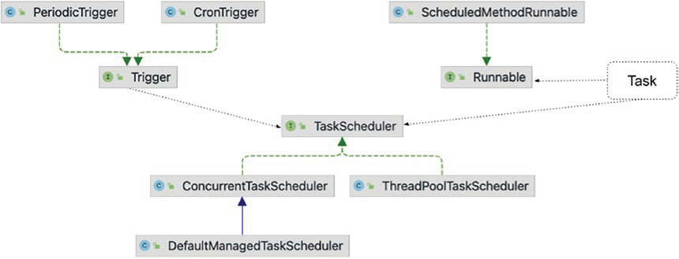

----------------------------------------------------
Luồng và Đa luồng trong java :

Luồng (thread) và đa luồng (multithreading) là các khái niệm quan trọng trong lập trình Java. Dưới đây là giải thích chi tiết về luồng, đa luồng và cơ chế bất đồng bộ trong Java kèm theo một bài toán minh họa dễ hiểu.

### Luồng và Đa Luồng trong Java

**Luồng (Thread):** Luồng là một đơn vị thực thi trong một chương trình. Mỗi luồng có thể thực thi các đoạn mã đồng thời với các luồng khác.

**Đa luồng (Multithreading):** Đa luồng là kỹ thuật cho phép một chương trình thực thi nhiều luồng đồng thời. Điều này giúp tận dụng tốt hơn tài nguyên của CPU và cải thiện hiệu suất của chương trình.

### Cơ Chế Bất Đồng Bộ trong Java

**Bất đồng bộ (Asynchronous):** Bất đồng bộ cho phép một đoạn mã chạy mà không cần đợi các đoạn mã khác hoàn thành. Trong Java, cơ chế bất đồng bộ thường được thực hiện bằng cách sử dụng các luồng hoặc các framework như `CompletableFuture`.

### Ví dụ Minh Họa

Hãy xem một ví dụ đơn giản để hiểu cách hoạt động của luồng và đa luồng trong Java.

#### Bài Toán: In Số từ 1 đến 5 từ hai Luồng Khác Nhau

Chúng ta sẽ tạo hai luồng, mỗi luồng sẽ in ra các số từ 1 đến 5.

```java
public class Main {
    public static void main(String[] args) {
        // Tạo luồng thứ nhất
        Thread thread1 = new Thread(() -> {
            for (int i = 1; i <= 5; i++) {
                System.out.println("Thread 1: " + i);
                try {
                    Thread.sleep(1000); // Tạm dừng 1 giây
                } catch (InterruptedException e) {
                    e.printStackTrace();
                }
            }
        });

        // Tạo luồng thứ hai
        Thread thread2 = new Thread(() -> {
            for (int i = 1; i <= 5; i++) {
                System.out.println("Thread 2: " + i);
                try {
                    Thread.sleep(1000); // Tạm dừng 1 giây
                } catch (InterruptedException e) {
                    e.printStackTrace();
                }
            }
        });

        // Bắt đầu các luồng
        thread1.start();
        thread2.start();
    }
}
```

### Giải Thích

- **Tạo Luồng:** Chúng ta sử dụng `Thread` để tạo các luồng. Mỗi luồng thực hiện một công việc cụ thể được định nghĩa trong khối mã lambda `() -> { ... }`.
- **Chạy Luồng:** Chúng ta sử dụng phương thức `start()` để bắt đầu luồng.
- **Tạm Dừng Luồng:** `Thread.sleep(1000)` tạm dừng luồng trong 1 giây giữa mỗi lần in số.

Khi chạy chương trình, hai luồng sẽ in các số từ 1 đến 5 đồng thời. Kết quả có thể trông như sau:

```
Thread 1: 1
Thread 2: 1
Thread 1: 2
Thread 2: 2
Thread 1: 3
Thread 2: 3
Thread 1: 4
Thread 2: 4
Thread 1: 5
Thread 2: 5
```

### Kết Luận
-----------------------------------------------------------------------------------

Trong Spring, cơ chế bất đồng bộ (asynchronous) và đa luồng (multithreading) được hỗ trợ một cách mạnh mẽ và dễ dàng sử dụng nhờ các annotations và các công cụ tích hợp sẵn. Dưới đây là các bước để triển khai cơ chế bất đồng bộ trong Spring:

### Bật Hỗ Trợ Bất Đồng Bộ trong Spring

Để bật hỗ trợ bất đồng bộ trong Spring, bạn cần thêm annotation `@EnableAsync` vào class cấu hình của bạn.

```java
import org.springframework.context.annotation.Configuration;
import org.springframework.scheduling.annotation.EnableAsync;

@Configuration
@EnableAsync
public class AppConfig {
    // cấu hình khác
}
```

### Sử Dụng Annotation @Async

Annotation `@Async` được sử dụng để đánh dấu các phương thức sẽ được thực thi bất đồng bộ. Khi một phương thức được đánh dấu bằng `@Async`, nó sẽ chạy trong một luồng riêng biệt mà không chặn luồng chính.

#### Ví Dụ: Triển Khai @Async trong Spring

Hãy xem một ví dụ đơn giản để hiểu cách triển khai cơ chế bất đồng bộ trong Spring.

```java
import org.springframework.scheduling.annotation.Async;
import org.springframework.stereotype.Service;

@Service
public class AsyncService {

    @Async
    public void asyncMethod() {
        System.out.println("Bắt đầu thực thi phương thức bất đồng bộ: " + Thread.currentThread().getName());
        try {
            Thread.sleep(2000); // Giả lập công việc mất thời gian
        } catch (InterruptedException e) {
            e.printStackTrace();
        }
        System.out.println("Hoàn thành phương thức bất đồng bộ: " + Thread.currentThread().getName());
    }
}
```

### Gọi Phương Thức Bất Đồng Bộ

Để gọi phương thức bất đồng bộ, bạn có thể làm như sau:

```java
import org.springframework.beans.factory.annotation.Autowired;
import org.springframework.boot.CommandLineRunner;
import org.springframework.boot.SpringApplication;
import org.springframework.boot.autoconfigure.SpringBootApplication;

@SpringBootApplication
public class Application implements CommandLineRunner {

    @Autowired
    private AsyncService asyncService;

    public static void main(String[] args) {
        SpringApplication.run(Application.class, args);
    }

    @Override
    public void run(String... args) throws Exception {
        System.out.println("Bắt đầu gọi phương thức bất đồng bộ");
        asyncService.asyncMethod();
        System.out.println("Hoàn thành gọi phương thức bất đồng bộ");
    }
}
```

### Kết Quả Dự Kiến

Khi bạn chạy ứng dụng Spring Boot này, bạn sẽ thấy rằng phương thức `asyncMethod` được thực thi bất đồng bộ:

```
Bắt đầu gọi phương thức bất đồng bộ
Bắt đầu thực thi phương thức bất đồng bộ: SimpleAsyncTaskExecutor-1
Hoàn thành gọi phương thức bất đồng bộ
Hoàn thành phương thức bất đồng bộ: SimpleAsyncTaskExecutor-1
```

### Giải Thích

- **Annotation @EnableAsync:** Bật hỗ trợ cho các phương thức bất đồng bộ.
- **Annotation @Async:** Đánh dấu phương thức sẽ được thực thi bất đồng bộ.
- **SimpleAsyncTaskExecutor:** Là một executor mặc định trong Spring, tạo ra các luồng mới cho mỗi nhiệm vụ.

Bạn có thể tùy chỉnh Executor để kiểm soát tốt hơn số lượng luồng và hành vi thực thi bằng cách định nghĩa một bean `TaskExecutor`.

```java
import org.springframework.context.annotation.Bean;
import org.springframework.context.annotation.Configuration;
import org.springframework.core.task.TaskExecutor;
import org.springframework.scheduling.concurrent.ThreadPoolTaskExecutor;

@Configuration
public class AppConfig {

    @Bean(name = "taskExecutor")
    public TaskExecutor taskExecutor() {
        ThreadPoolTaskExecutor executor = new ThreadPoolTaskExecutor();
        executor.setCorePoolSize(5);
        executor.setMaxPoolSize(10);
        executor.setQueueCapacity(25);
        executor.setThreadNamePrefix("AsyncThread-");
        executor.initialize();
        return executor;
    }
}
```

Trong ví dụ này, bạn đã cấu hình một `ThreadPoolTaskExecutor` với một số lượng luồng tối thiểu là 5 và tối đa là 10, cùng với khả năng đợi lên đến 25 nhiệm vụ trong hàng đợi. Luồng sẽ có tiền tố là "AsyncThread-".

Sử dụng các công cụ này, bạn có thể triển khai các tác vụ bất đồng bộ và đa luồng một cách dễ dàng trong ứng dụng Spring của mình.